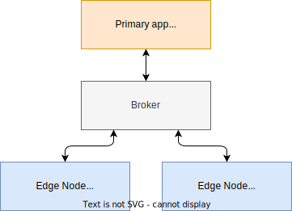

# Sparkplug example

This is a simple SparkplugB network example using C#/.NETv8 and [SparkplugNet](https://github.com/SeppPenner/SparkplugNet).

## How to run the example

1. Open `SparkplugDemo.sln` with Visual Studio 2022
2. Set `SimulationHost` as startup application
3. Get the connection details to your MQTT broker
4. Modifiy the PrimaryApp/Config.cs (broker host/port)
5. Modifiy the EdgeNode/Config.cs (broker host/port)

## Links

- [The Sparkplug Specification](https://sparkplug.eclipse.org/specification/)
- [eclipse/sparkplug on GitHub](https://github.com/eclipse-sparkplug/sparkplug)
- [SparkplugNet](https://github.com/SeppPenner/SparkplugNet)